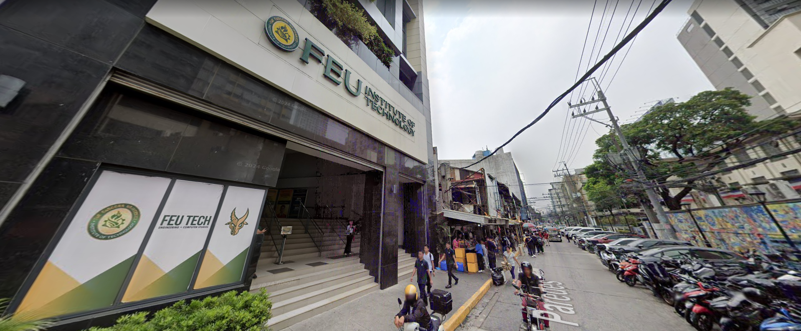
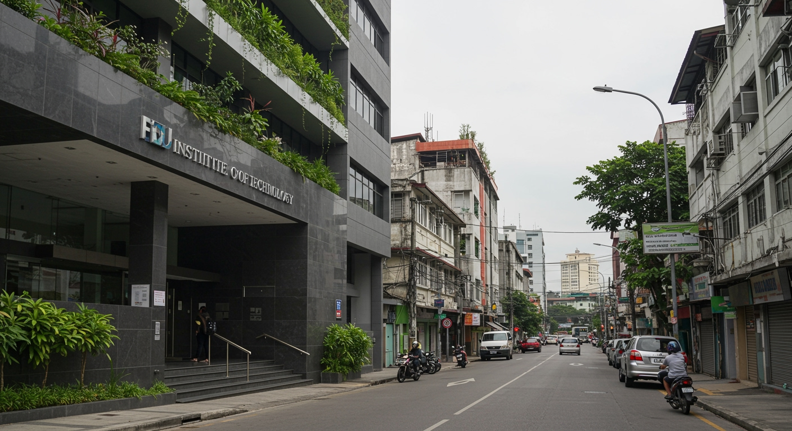
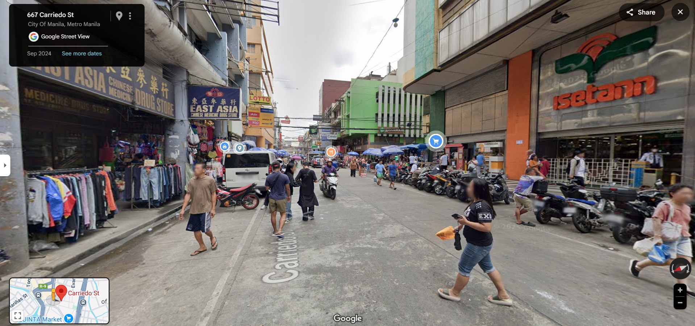
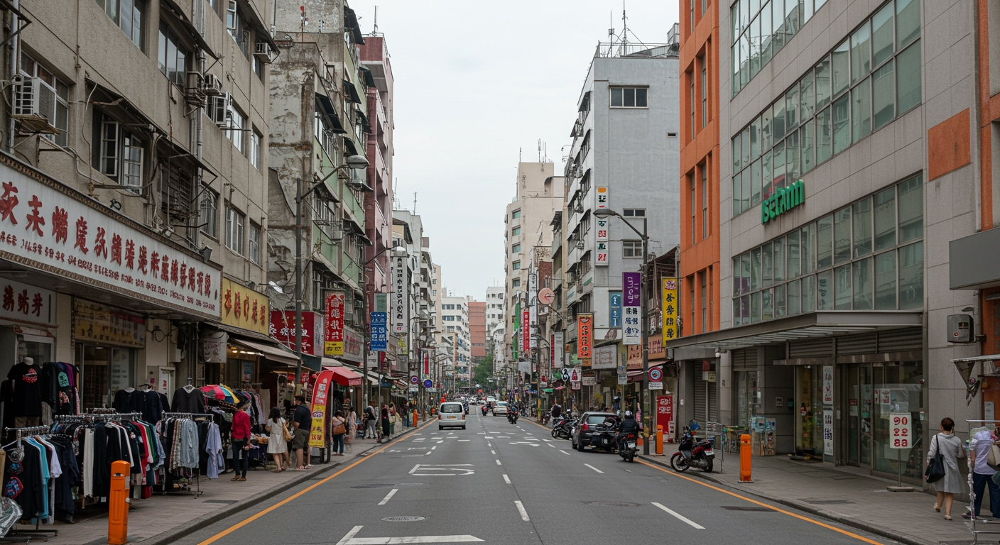
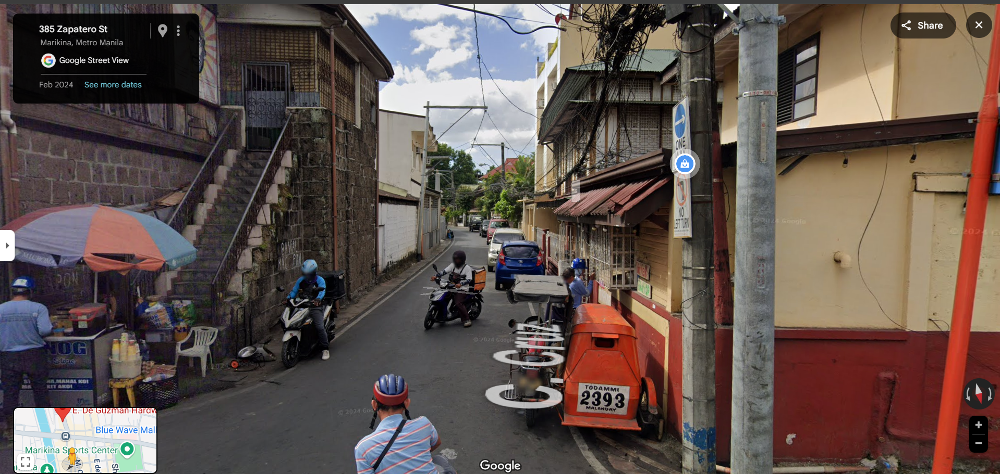
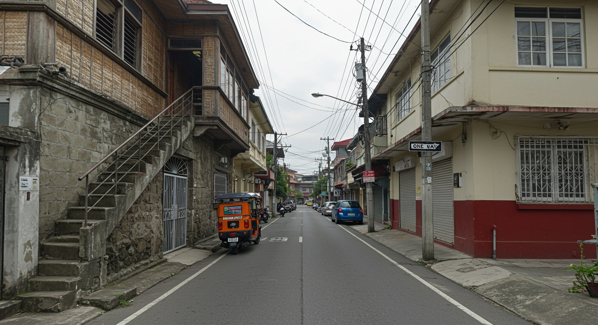
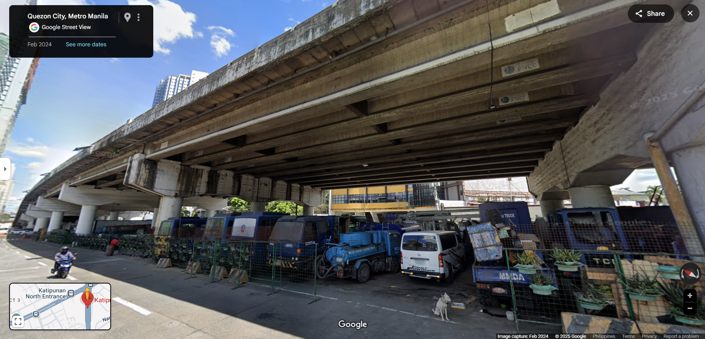
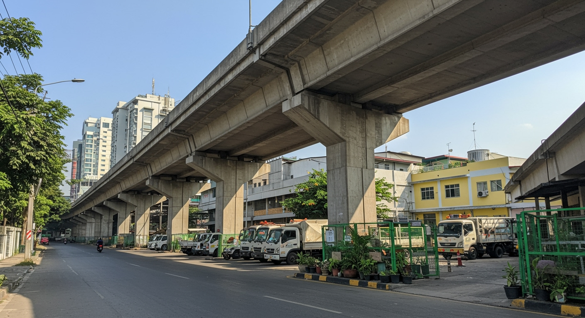

# Ginhawa AI: Reality and Potential

<div align="center">
  <p>
    Visualize the cities you deserve. An AI tool for transforming urban and rural streets into people-first spaces.
  </p>
</div>

---

## 📑 Table of Contents

- [📒About The Project](#about-the-project)
- [💚Example Transformations](#example-transformations)
- [🔧Built With](#built-with)
- [💻Setup](#setup)
- [✅Tests](#tests)
- [🗺️Roadmap](#roadmap)
- [🤝Contributing](#contributing)
- [✉️Authors](#authors)
- [⭐Acknowledgments](#acknowledgments)
- [📦Version History](#version-history)

---


### About The Project

**Ginhawa AI** helps you visualize the cities and towns you deserve through AI-powered transformation. The name "Ginhawa" is a Filipino word for "relief" or "comfort," reflecting our goal: to help redesign public spaces so they truly serve people.

This tool empowers anyone to reimagine their streets. Upload a photo of any urban or rural space, and watch as AI generates a new vision—one that is greener, more walkable, and designed for human connection.

Our mission is to inspire change by making the potential of our communities tangible and beautiful.

[Back to Top](#-table-of-contents)

---


### Example Transformations

<table>
  <tr>
    <td align="center">
      <a href="examples/feu-tech-real.png">
        
      </a>
      <br>
      <em>Original street view of FEU Tech, P. Paredes Street, Manila</em>
    </td>
    <td align="center">
      <a href="examples/feu-tech-potential.png">
        
      </a>
      <br>
      <em>💚Transformed vision</em>
    </td>
  </tr>

  <tr>
    <td align="center">
      <a href="examples/carriedo-real.png">
        
      </a>
      <br>
      <em>Original street view of Carriedo Street, Quiapo, Manila</em>
    </td>
    <td align="center">
      <a href="examples/carriedo-potential.png">
        
      </a>
      <br>
      <em>💚Transformed vision</em>
    </td>
  </tr>

   <tr>
    <td align="center">
      <a href="examples/zapatero-real.png">
        
      </a>
      <br>
      <em>Original street view of Zapatero Street, Marikina</em>
    </td>
    <td align="center">
      <a href="examples/zapatero-potential.png">
        
      </a>
      <br>
      <em>💚Transformed vision</em>
    </td>
  </tr>

  <tr>
    <td align="center">
      <a href="examples/katipunan-real.png">
        
      </a>
      <br>
      <em>Original street view along Katipunan Avenue, Quezon City</em>
    </td>
    <td align="center">
      <a href="examples/katipunan-potential.png">
        
      </a>
      <br>
      <em>💚Transformed vision</em>
    </td>
  </tr>
</table>

[Back to Top](#-table-of-contents)

---


### Built With

*   **Frontend:** [React](https://react.dev/) & [TypeScript](https://www.typescriptlang.org/)
*   **AI Models:**
    *   [Google Gemini 2.5 Flash](https://ai.google.dev/) for image analysis.
    *   [Google Imagen 3](https://ai.google.dev/) for image generation.
*   **Styling:** Modern CSS with Custom Properties

[Back to Top](#-table-of-contents)

---


### Setup

To get a local copy up and running, follow these simple steps.

#### Prerequisites

- Node.js

- You will need a Google AI API key. You can get one from the [Google AI Studio](https://aistudio.google.com/app/apikey).

#### Installation

This project is set up to run directly in the browser without a complex build process.

1.  **Clone the repository:**
    ```sh
    git clone https://github.com/ralphcajipe/ginhawa-ai.git
    cd ginhawa-ai
    ```

2.  **Set up your API Key:**
    Set the `GEMINI_API_KEY` in [.env.local](.env.local) to your Gemini API key

3.  **Run the app:**
    `npm run dev`

[Back to Top](#-table-of-contents)

---


### Tests

Currently, the project does not have an automated testing suite. Manual testing can be performed by:
1.  Running the application locally.
2.  Uploading various street-view images (JPEG, PNG).
3.  Verifying that a transformed image is generated successfully.
4.  Checking for proper error handling when an image is not uploaded or the API key is invalid.

[Back to Top](#-table-of-contents)

---


### Roadmap

*   [ ] Allow users to customize the transformation prompt (e.g., "spanish colonial era style," "add more bike lanes").
*   [ ] Add a "Share to Social Media" feature.
*   [ ] Implement user accounts to save a history of transformations.
*   [ ] Integrate with a mapping service to tag locations.

See the [open issues](https://github.com/ralphcajipe/ginhawa-ai/issues) for a full list of proposed features (and known issues).

[Back to Top](#-table-of-contents)

---


### Contributing

If you have a suggestion that would make this better, please fork the repo and create a pull request. You can also simply open an issue with the tag "enhancement."

[Back to Top](#-table-of-contents)

---


### Authors

*   **Ralph Cajipe** - *Developer* - [ralphcajipe](https://github.com/ralphcajipe)

[Back to Top](#-table-of-contents)

---


### Acknowledgments

*   [Google AI](https://ai.google.dev/) for the powerful Gemini and Imagen models.
*   Inspiration from urbanists and communities advocating for better cities, especially my friend [Stephen](https://github.com/Stephencamilon) who encouraged me to build this.

[Back to Top](#-table-of-contents)

---


### Version History

*   **v1.0.0** (Current)
    *   Initial release with core functionality: upload an image and generate its potential transformation.

[Back to Top](#-table-of-contents)
